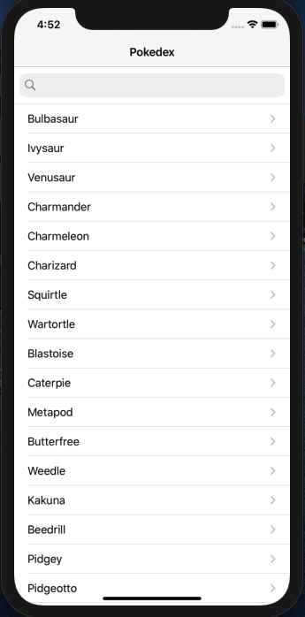
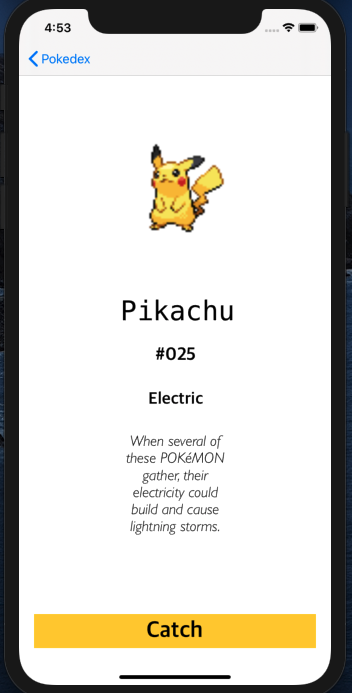

# Pokédex iOS App 
- Allows users to search the Pokédex for their favorite Pokémon
- Written in Swift  
- 2 View Controllers  
  View Controller 1: Displays the list of Pokemons  
  View Controller 2: Displays details of Pokemon 

<b>Overview </b>
- Using Pokemon API, fetch Pokemon details for View Controller 1 
- 2nd API call to get Pokemon details for View Contoller 2 
  Pokemon Image 
  Index 
  Pokemon type 
 - 3rd API call to get Pokemon Description in English 

<b>Functionalities </b>
- View Controller 1  

- Search function 

- View Controller 2 
Users are able to "Catch" / "Release" a pokemon   
State is stored in UserDefaults  

